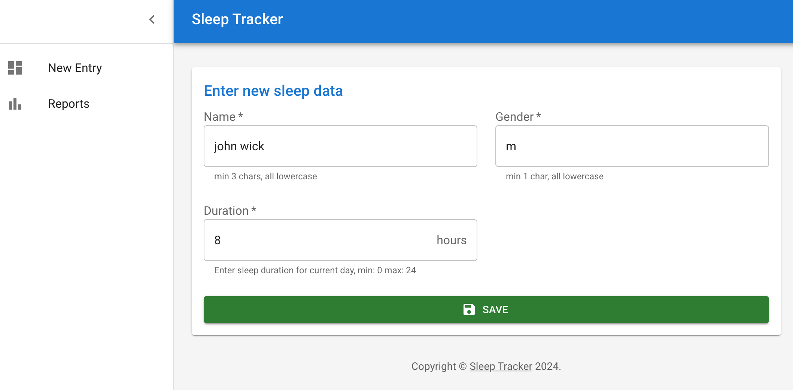
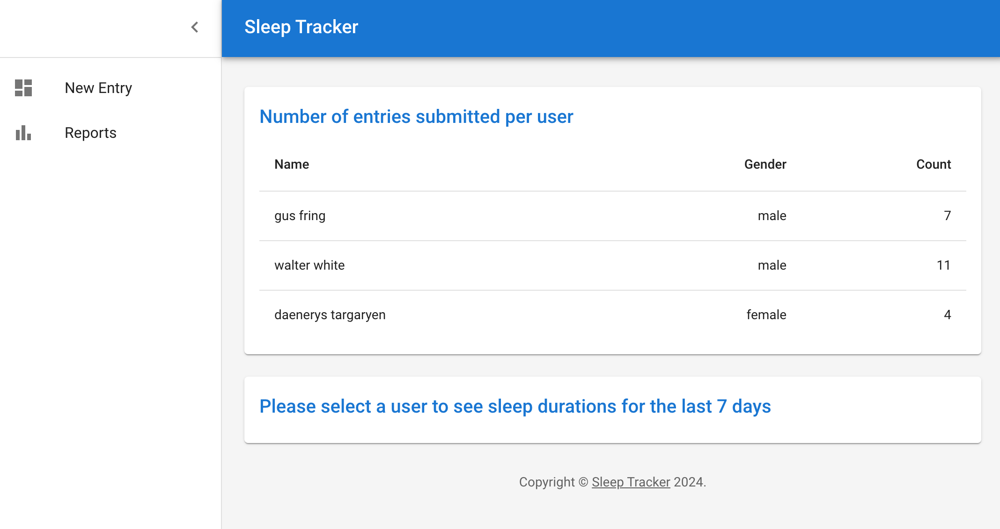
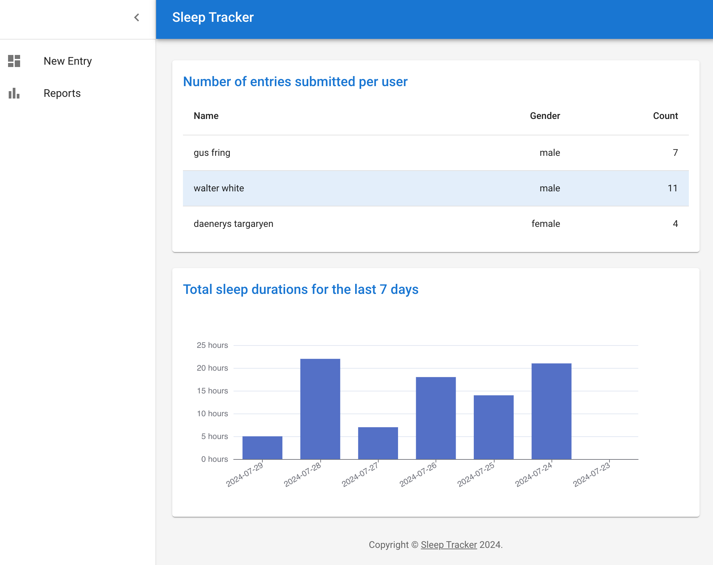

# sleep tracker

## How to run locally

1. [Install Docker](https://docs.docker.com/engine/install/)
2. run `docker-compose up -d`
3. navigate to `localhost:3000`

New entry page screen shot:


Total entry counts per users:


Weeklty summary bar chart per user:


For demo purposes, an initial demo data is generated with [postgresql init db](./initdb.sql)

## Estimations

| description | estimate |
| ----------- | -------- |
| development test setup | 2 hours |
| backend project setup | 3 hours |
| 3x backend api implementation | 3 hours |
| frontend project setup | 2 hours |
| frontend new entry page | 1 hour |
| frontend reports page counts table | 1 hour |
| frontend reports page bar chart | 3 hours |
| overall tests | 2 hours |
| total | 17 hours |

> I spent ~20 hours in total across 3 days.

## Future Considerations

1. I don't use migrations in the backend to create tables in the database. instead I just rely on orm to synchronize all changes which is not ideal for production environments.
2. In the frontend application I used static backend api base url which needs to be updated if it needs to be deployed to a different environment than local machines.
3. I was planning to add some frontend tests with Cypress but I spent too much time installing Next.js so I decided to skip the frontend tests.
4. Next.Js provides a full stack solution as it can serve both pages and apis, but I decided to have a separate backend api server implementation as I thought this would be easier to review.

## Run local development servers

1. [Install Nodejs 20+](https://nodejs.org/en/download/package-manager/current)
2. Install npm dependencies for both `frontend` and `backend` folder separately bu running `npm install`
3. You can start each by running `npm run dev` from separate shells

## Running backend tests

Backend tests cases runs in isolation with its separate docker-compose file which ensures a clean database for each test run.

To run back tests:

```sh
cd backend
npm run test
```
